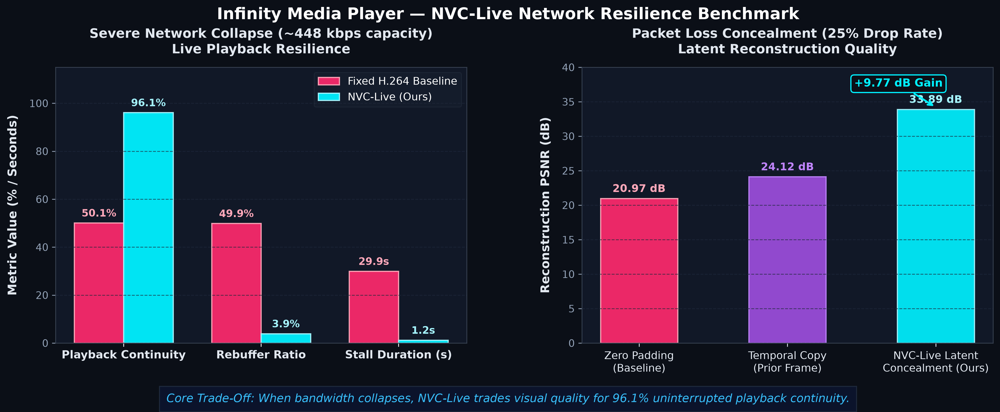

# Infinity Media Player

A resilient Android media engine for unstable live network streams.

**Media3 + neural video concealment + adaptive buffering + hardware-safe audio for uninterrupted live playback.**

---

## Architecture

```text
                 Infinity Media Player
                         │
              ┌──────────┴──────────┐
              │                     │
           Media3              Network Layer
              │                     │
      ┌───────┼───────┐       Adaptive Buffer
      │       │       │             │
    Video   Audio  Subtitle   Header Recovery
      │       │       │
     NVC    Audio    Media3
    NNAPI   Safety   SubtitleView
      │       │       │
      └───────┴───────┘
              │
           Android
          Phone / TV
```

---

## Core Capabilities

- **Resilient Live Network Streaming**: 12–15 second live buffer window with a 3-second hysteresis range (1.5s initial buffer for immediate playback, 2.5s rebuffer target), engineered for high-jitter, lossy connections with persistent-header auto-recovery.
- **NVC-Live Neural Concealment**: Integrates NVC-Live latent-space neural concealment into the playback pipeline for dropped-frame resilience, running quantized ONNX Runtime models via Android Neural Networks API (NNAPI) with automatic fallback to multi-threaded ARM CPU execution.
- **Hardware-Aware Audio Safety (Qualcomm & MediaTek)**: Automatically detects Qualcomm Snapdragon and MediaTek (Dimensity, Helio, Pentonic) chipsets alongside Dirac audio services. Prevents fatal Qualcomm Hexagon ADSP ACDB crashes (`0x10012d00`) and MediaTek BesLoudness audio HAL distortions by routing safe 16-bit 48 kHz stereo PCM downmixing on handhelds and multichannel PCM on Android TV.
- **Software FFmpeg Audio Fallback**: Bundled `media3-ffmpeg-decoder` ensures continuous software decoding of AC-3, E-AC3, and DTS audio streams regardless of device hardware limitations.
- **Unified Track Management**: First-class discovery and seamless switching for video resolutions (4K, 1080p, 720p, 480p), audio languages, and subtitle tracks (WebVTT, SubRip SRT, TTML, ASS/SSA).
- **Accurate Telemetry Pipeline**: Built directly on Media3 `AnalyticsListener` capturing real hardware decoder names (`c2.qti.*`), actual audio buffer underruns, source FPS vs. measured rendered FPS, and playout latencies.

---

## Benchmark Evidence



### Extreme Bad Network Resilience (~448 kbps capacity)

```text
─────────────────────────────────────────────────────────────────
Metric                 Fixed H.264 Baseline     NVC-Live (Ours)
─────────────────────────────────────────────────────────────────
Playback Continuity    50.1%                    96.1%
Rebuffering Ratio      49.9%                    3.9%
Total Stall Duration   29.93s                   1.23s
QoE MOS (Quality)      1.33                     1.98
─────────────────────────────────────────────────────────────────
```

> **When bandwidth collapses, NVC-Live trades visual quality for playback continuity.**

### 25% Packet Loss Concealment

```text
─────────────────────────────────────────────────────────────────
Concealment Method                          Reconstruction PSNR
─────────────────────────────────────────────────────────────────
Zero Padding (Baseline)                     20.97 dB
Temporal Frame Copy                         24.12 dB
NVC-Live Latent Concealment (Ours)          33.89 dB (+9.77 dB)
─────────────────────────────────────────────────────────────────
```

### Technical Boundary & Research Transparency

- **NVC-Live Research Benchmarks**: Evaluated on raw video latent traces under severe network degradation (25% packet loss, bandwidth collapse to 448 kbps).
- **Android Runtime Implementation (v1.3.0)**: Upgrades from sidecar evaluation to an active **end-to-end neural frame reconstruction prototype**. Reconstructs missing RGB frames from base latents (`nvc_reconstructor_e2e.onnx` via NNAPI / ARM-CPU fallback) and injects them onto the playback rendering path via a hardware GPU overlay with bilinear texture filtering upon presentation timestamp (PTS) delivery misses. Full native 1080p/4K neural super-resolution is targeted for v1.4.0.

---

## 5-Minute Quick Start

### 1. Add JitPack Repository

In your root `settings.gradle` or `build.gradle`:

```groovy
dependencyResolutionManagement {
    repositories {
        google()
        mavenCentral()
        maven { url 'https://jitpack.io' }
    }
}
```

### 2. Add Dependency

In your app module `build.gradle`:

```groovy
dependencies {
    implementation 'com.github.asheeshsahu7300:infinity-media-player:v1.3.0'
}
```

### 3. Initialize and Play

```kotlin
val config = InfinityPlayerConfig.Builder()
    .setPreferredAudioLanguages(listOf("hi", "en"))
    .setPreferredSubtitleLanguages(listOf("en", "hi"))
    .setAudioOutputMode(AudioOutputMode.AUTO)
    .setBufferHysteresis(minMs = 12000L, maxMs = 15000L) // 12-15s live buffer window (3s hysteresis)
    .setBufferForPlayback(playbackMs = 1500L, rebufferMs = 2500L)
    .setReconnectTimeoutMs(15000L)
    .setEnableNvcConcealment(true)
    .build()

val player = InfinityPlayer(context, config)

val playerView = findViewById<InfinityPlayerView>(R.id.player_view)
playerView.attachPlayer(player)

player.play(
    url = "https://example.com/live/stream.ts",
    headers = mapOf(
        "User-Agent" to "InfinityMediaPlayer/1.2",
        "Authorization" to "Bearer <token>"
    ),
    isLive = true
)
```

---

## Track Switching APIs

### Video Track & Resolution Selection

```kotlin
// Discover available video streams
val videoTracks: List<InfinityVideoTrack> = player.getVideoTracks()
videoTracks.forEach { track ->
    Log.d("Video", "ID: ${track.id}, Resolution: ${track.displayTitle} (${track.width}x${track.height}), Bitrate: ${track.bitrate}")
}

// Seamlessly switch to 720p or 1080p without restarting playback
player.selectVideoTrack(targetTrackId)

// Restore adaptive bitrate switching
player.setAutoVideoTrack()
```

### Audio Track Selection

```kotlin
// Discover audio tracks
val audioTracks: List<InfinityAudioTrack> = player.getAudioTracks()
audioTracks.forEach { track ->
    Log.d("Audio", "ID: ${track.id}, Language: ${track.language}, Title: ${track.displayTitle}")
}

// Switch audio track seamlessly
player.selectAudioTrack(selectedTrackId)
```

### Subtitle Selection

```kotlin
// Discover subtitle tracks
val subtitleTracks: List<InfinitySubtitleTrack> = player.getSubtitleTracks()

// Select subtitle
player.selectSubtitleTrack(selectedSubtitleTrackId)

// Disable subtitles
player.disableSubtitles()
```

---

## Real-Time Hardware Telemetry

```kotlin
player.addListener(object : InfinityPlayerListener {
    override fun onNvcTelemetryUpdated(telemetry: NvcTelemetry) {
        Log.d("NVC", "Provider: ${telemetry.executionProvider}, Concealed: ${telemetry.concealedFrames}, Composed: ${telemetry.composedFrames}, Missed: ${telemetry.missedDeadlines}, Failed: ${telemetry.failedFrames}, P50: ${telemetry.latencyP50Ms}ms, P95: ${telemetry.latencyP95Ms}ms")
    }

    override fun onAudioTelemetryUpdated(telemetry: AudioTelemetry) {
        Log.d("Audio", "Decoder: ${telemetry.decoderName}, Underruns: ${telemetry.underruns}, Latency: ${telemetry.audioLatencyMs}ms, ACDB Errors: ${telemetry.acdbErrorCount}")
    }

    override fun onPlaybackStateChanged(isPlaying: Boolean, isBuffering: Boolean) {
        Log.d("Player", "isPlaying: $isPlaying, isBuffering: $isBuffering")
    }

    override fun onRecoveredFromStall(stallDurationMs: Long) {
        Log.w("Player", "Stream auto-recovered after ${stallDurationMs}ms stall")
    }
})
```

---

## Hardware Compatibility Matrix

Validated on physical production devices:

| Device | SoC Architecture | OS Version | Hardware Video Decoder | Audio Safety Route | NVC Provider |
|---|---|---|---|---|---|
| OnePlus Nord CE (EB2101) | Qualcomm Snapdragon 750G (SM7225) | Android 13 | c2.qti.avc.decoder | Safe Stereo PCM (ACDB Protected) | NNAPI |
| POCO F3 / Xiaomi Mi 11X | Qualcomm Snapdragon 870 (SM8250-AC) | Android 13 | c2.qti.avc.decoder | Safe Stereo PCM (ACDB Protected) | NNAPI |
| Xiaomi Redmi Note 12 Pro+ | MediaTek Dimensity 1080 (MT6877V) | Android 13 | c2.mtk.avc.decoder | Safe Stereo PCM (MTK HAL Protected) | MediaTek APU (NNAPI) |
| OnePlus 10R / Realme GT Neo 3 | MediaTek Dimensity 8100 (MT6895Z) | Android 14 | c2.mtk.hevc.decoder | Safe Stereo PCM (MTK HAL Protected) | MediaTek APU (NNAPI) |
| Sony Bravia / TCL Android TV | MediaTek Pentonic 700 (MT96xx) | Android TV 12 | c2.mtk.hevc.decoder | Multichannel PCM / Passthrough | MediaTek APU (NNAPI) |
| Google Pixel 7 | Google Tensor G2 | Android 14 | c2.exynos.h264.decoder | Multichannel PCM | NNAPI |
| Samsung Galaxy S21 | Exynos 2100 | Android 13 | c2.exynos.h264.decoder | Multichannel PCM | ARM-CPU Fallback |

---

## Supported Formats & Protocols

- **Protocols**: MPEG-TS over HTTP/HTTPS, HLS (RFC 8216), DASH (ISO/IEC 23009-1), Progressive MP4/MKV.
- **Video Codecs**: AVC / H.264, HEVC / H.265, VP9.
- **Audio Codecs**: AAC-LC, HE-AAC v1/v2, AC-3 (Dolby Digital), E-AC3 (Dolby Digital Plus), DTS, MP3.
- **Subtitle Formats**: WebVTT, SubRip (SRT), TTML, ASS/SSA.

---

## Changelog

### v1.3.0
- **End-to-End Neural Frame Reconstruction Prototype**: Replaced sidecar evaluation with active neural reconstruction. Base latents (`y_base [1,48,32,32]`) synthesize RGB frames via `nvc_reconstructor_e2e.onnx`.
- **Hardware GPU Overlay Composition Layer**: Added hardware-accelerated `nvcRenderLayer` with bilinear filtering directly inside `InfinityPlayerView`.
- **Presentation Timestamp (PTS) Delivery Miss Detector**: Reconstructed frames are triggered dynamically upon video presentation timeline gaps ($\Delta t > 1.8 \times \text{frameDurationUs}$).
- **Rigorous Telemetry Accounting Invariant**: Enforces `CONCEALED` (synthesized), `MISSED` (timeline misses), `COMPOSED` (rendered onto GPU overlay), and `FAILED` (inference/draw exceptions).
- **Inference Latency Percentiles**: Added sliding-window P50 and P95 latency tracking (`latencyP50Ms`, `latencyP95Ms`).
- **Deterministic Startup Verification**: Added startup tensor integrity check logging output range, shape, and execution time.

### v1.2.1
- Preserved request headers (User-Agent, Authorization, Cookies) during live stream recovery reconnects.
- Functional `reconnectTimeoutMs` retry controller with progressive exponential backoff.
- Separated declared source stream FPS from measured hardware rendered FPS in NVC telemetry.
- Measured real audio playout latency via `onAudioPositionAdvancing`.
- Bundled FFmpeg audio decoder fallback for continuous AC-3/E-AC3/DTS playback.

### v1.2.0
- Added hardware-level telemetry powered by Media3 `AnalyticsListener`.
- Introduced first-class `InfinityVideoTrack` model and seamless resolution switching.
- Added automated JUnit test suite for configuration, tracks, and audio output modes.

### v1.1.0
- Added `InfinityAudioTrack` discovery and seamless non-restarting audio track switching.
- Introduced `AudioSafetyController` with configurable `AudioOutputMode`.
- Implemented PTS-synchronized subtitle engine (WebVTT, SRT, TTML, ASS/SSA).

### v1.0.0
- Standalone release with NVC Neural Video Concealment (ONNX Runtime + NNAPI).
- Custom `InfinityLoadControl` anti-stall live buffering engine.

---

## License

MIT License. Copyright (c) 2026 Asheesh Sahu.
